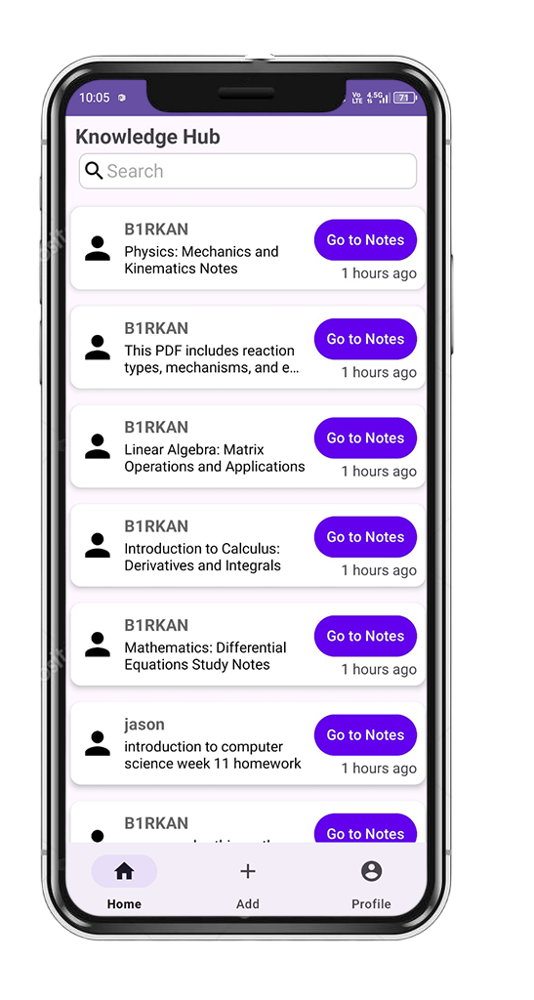
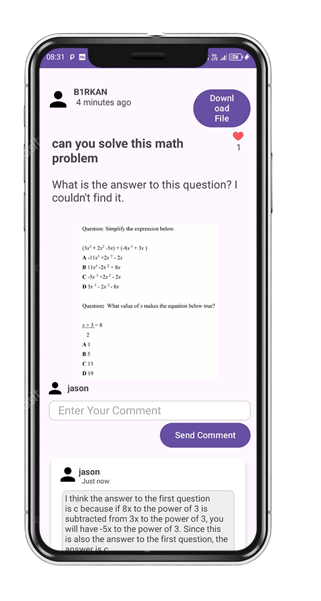
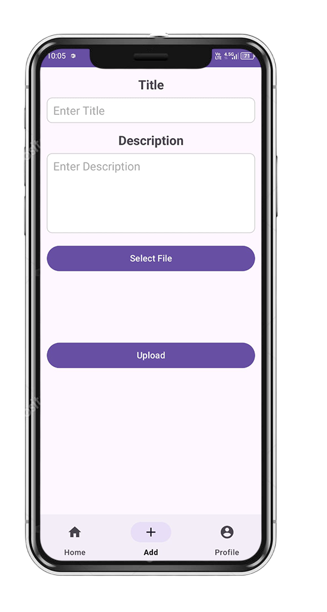

# 📚 KNOWLEDGE HUB

A small-scale social media application where students can share course-related materials (notes, PDFs, images, etc.) with each other, allowing all students to access course information.

    
    
    

---

## 📝 About the Application

- 📂 *Ability to add PDFs related to desired courses.*  
- 🖼️ *Ability to add images related to desired courses.*  
- 👍 *Like and comment on added course documents.*  
- 🛠️ *Edit profile details (e.g., change name).*  
- ⭐ *View the course notes you liked.*  
- 📑 *View the notes you have shared.*  

---

## 🔧 Technologies Used

- *Firebase*: All data except files are stored using Firebase.  
- *AWS S3*: Uploaded files are stored in this section.  
- *Picasso*: Used for fetching and displaying images.  
- *ViewBinding*: Used to access XML layout files easily.  
- *Intent*: Used for navigating between pages.  

---
